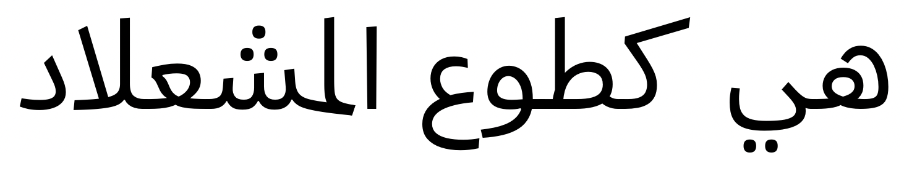
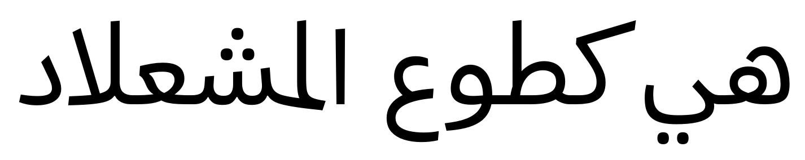
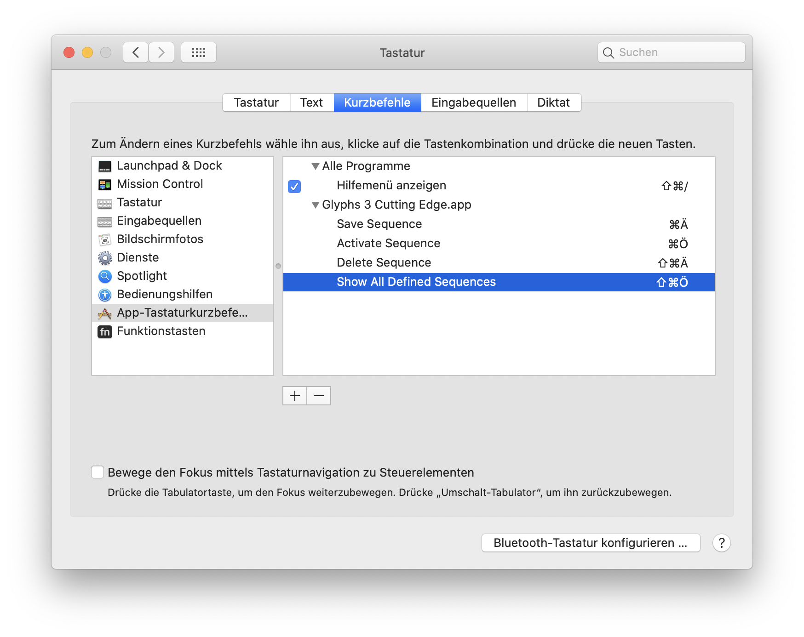

# Proof of Concept: Contextual Kerning Mode for Glyphs 3

Makeshift scriptlets to edit contextual kerning in Glyphs.app and save that into the `kern` feature.

`Warning: Code is in ALPHA stage quality. Backup your font before playing with it.`

## Why does this exist?

No present-day font editor has a user interface to define contextual kerning. You can define normal kerning between two glyphs, akin to `pos a b -10`, but you can’t even have multiple kerning classes per glyph so that glyphs can perform differently in different situations, and neither can you define contextual kerning. These scriptlets solve the latter problem.

Contextual kerning in its simplest form is kerning applied to a single kerning pair, *but only if followed by another glyph* (the context).
In feature code, this is expressed as `pos a' b c -10`.

## Current implementation

The first inner position of a 3-glyph-sequence is processed equivalent to `pos a' b c -10`, leaving the pre-context empty and setting the post-context to just the first glyph after the active kerning pair (cursor). Other pre and post contexts are thinkable but currently unsupported for lack of a user interface.

Both `LTR` and `RTL` directions are processed. In case of `RTL`, `IgnoreMarks` is also added to the final feature code, just FYI.

Kerning classes are used to identify the sequence when present. The kerning classes of the glyph side that’s pointing towards the cursor is used. This currently prevents contextual kerning exceptions, again for the lack of a user interface.

## How to install

What I do is check out this entire repository directly into the scripts folder of Glyphs. You would find these in the _Scripts_ menu of Glyphs under _Yanone-GlyphsApp-Scripts → Contextual Kerning_

## How it works under the hood

Glyphs has only one dictionary to store kerning and no facility to process contextual kerning. 

These scriptlets work around that by activating a _Contextual Kerning Mode_ where the traditional kerning UI/UX of Glyphs is hijacked to edit contextual kerning for the glyph sequence currently visible in the edit view at the cursor position. 

Then, upon saving of the contextual kerning, the contextual kerning is stored in the so-called [Tokens](https://glyphsapp.com/learn/tokens) of each font master (visible in the Masters tab of Font Info at the bottom) and the original traditional kerning is restored.

In the `kern` feature, the contextual kerning values are then accessed through the _Tokens_ by their variable name, e.g. `pos a' b c $contextualkerning;`. When generating the font, the tokens are expanded into their numeric values and interpolated between masters. This is also supported in [glyphsLib](https://github.com/googlefonts/glyphsLib).

## Usage

The usage in the following sequence needs to be repeated for each contextual kerning situation:

* ___Activate Sequence___ from menu
* Confirm feature code definition of sequence in the _Macro Panel_
* Manually adjust contextual kerning sequence across all masters
* ___Save Sequence___ from menu

Finally, you may use the scriptlet ___Generate Kern Feature___ to put the feature code into your font’s `kern` feature before generating a font. This needs to be repeated only if the amount of contextual kerning pairs has changed or if kerning class members have changed (because classes end up expanded in the feature code and that needs updating), not after you’ve adjusted individual contextual kerning values.

You can also load all stored sequences with ___Show All Defined Sequences___ and delete a sequence with ___Delete Sequence___ (after activation, as you need to confirm precisely which sequence you’re working on)

## Limitations

* I couldn’t find a way yet to programmatically delete a _Token_ from a font master. I need to ask Georg how to do that. Until that's possible, "deleting" a sequence will actually set all values to 0. This is dumb because it will still end up in your feature code like that, just not have any effect. Looking for a solution to this.
* There is currently no support for exceptions to contextual kerning and I'm not sure how to go about this.
* When showing all defined sequences, I wanted to show the one line at a time, but adding `GSControlCharacter` items to the tab results in an error in Glyphs. Again, I need to consult with Georg for that. Until then, the sequences are simply separated by a word space.

## Example

Below you see the the kerned contextual sequence using the feature code `pos @yeh.fina' space @kaf.init <-150 0 -150 0>` as generated by the scriptlets.

Without contextual kerning (see first word space from right):

With contextual kerning:

## Keyboard Shortcuts

For faster access, create yourself custom keyboard shortcuts for at the very least `Activate Sequence` and `Save Sequence` (as these are the commonly used) for Glyphs.app in the Keyboard section of macOS’s System Preferences:

